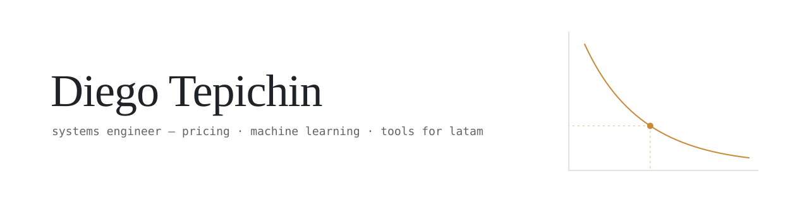
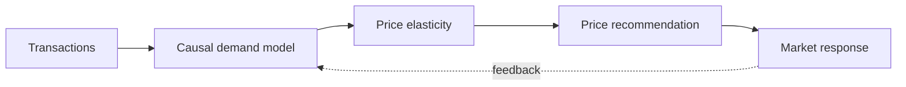

<picture>
  <source media="(prefers-color-scheme: dark)" srcset="assets/banner-dark.svg">
  <source media="(prefers-color-scheme: light)" srcset="assets/banner-light.svg">
  
</picture>

I build data-driven software where pricing, machine learning and real-world operations meet — currently focused on causal methods for dynamic pricing, and on open tools for Mexico and Latin America.

**Open to:** remote backend / ML engineering roles · **Based in:** Mexico (UTC−6) · **Languages:** Spanish, English

---

### CAFE — Causal Adaptive Fusion Engine

A dynamic pricing engine that estimates how demand actually responds to price — using causal inference instead of correlation — and turns that into price recommendations that adapt over time. → [cafe-pricing.netlify.app](https://cafe-pricing.netlify.app)

### Selected work

| Project | What it does | Stack |
|---|---|---|
| [calculadoras-mx](https://github.com/DiegoTepichin/calculadoras-mx) | Fully static calculators for Mexican tax & labor law (ISR, aguinaldo, finiquito, UMA) | Next.js · TypeScript |
| [sys-monitor](https://github.com/DiegoTepichin/sys-monitor) | Lightweight host monitoring: agent → authenticated API → live dashboard, one container | Python · Flask · React · Docker |
| [cicd-pipeline](https://github.com/DiegoTepichin/cicd-pipeline) | Reference delivery pipeline with lint, typing, SAST, coverage gate, image scanning and registry publishing | GitHub Actions · Docker · Trivy |

### Toolbox

`Python` `pandas` `scikit-learn` `Flask` `React` `TypeScript` `Next.js` `Docker` `GitHub Actions`

---

[LinkedIn](https://www.linkedin.com/in/diego-duron-tepichin) · [durontepichindiego@gmail.com](mailto:durontepichindiego@gmail.com)

Versión en español

Desarrollo software basado en datos donde se cruzan el pricing, el machine learning y la operación real de negocios. Hoy me enfoco en métodos causales para precios dinámicos y en herramientas abiertas para México y Latinoamérica.

**Abierto a:** roles remotos de backend / ML · **Ubicación:** México (UTC−6)

**CAFE** estima cómo responde realmente la demanda al precio, usando inferencia causal en lugar de correlación, y lo convierte en recomendaciones de precio que se adaptan con el tiempo.

