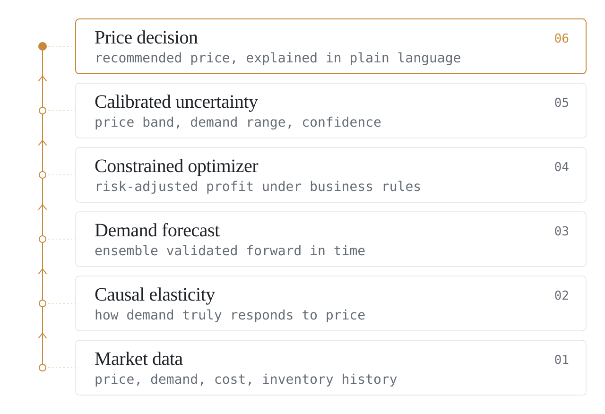
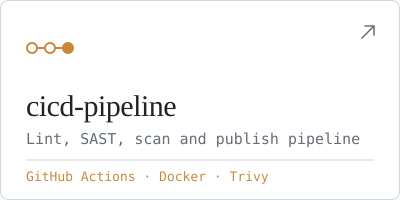

<picture>
  <source media="(prefers-color-scheme: dark)" srcset="assets/banner-dark.svg">
  <source media="(prefers-color-scheme: light)" srcset="assets/banner-light.svg">
  
</picture>

I build data-driven software where pricing, machine learning and real-world operations meet — currently focused on causal methods for dynamic pricing, and on open tools for Mexico and Latin America.

**Open to:** remote backend / ML engineering roles · **Based in:** Mexico (UTC−6) · **Languages:** Spanish, English

<picture>
  <source media="(prefers-color-scheme: dark)" srcset="assets/divider-dark.svg">
  <source media="(prefers-color-scheme: light)" srcset="assets/divider-light.svg">
  
</picture>

### CAFE — Causal Adaptive Fusion Engine

A dynamic pricing engine that estimates how demand actually responds to price — using causal inference instead of correlation — and turns that into price recommendations that adapt over time.

<picture>
  <source media="(prefers-color-scheme: dark)" srcset="assets/cafe-architecture-dark.svg">
  <source media="(prefers-color-scheme: light)" srcset="assets/cafe-architecture-light.svg">
  
</picture>

  

**v4.3.0** · Python · NumPy · SciPy · pandas · XGBoost · LightGBM · FastAPI

Available for licensing and acquisition → cafe.licensing@proton.me · [cafe-pricing.netlify.app](https://cafe-pricing.netlify.app)

<picture>
  <source media="(prefers-color-scheme: dark)" srcset="assets/divider-dark.svg">
  <source media="(prefers-color-scheme: light)" srcset="assets/divider-light.svg">
  
</picture>

### Selected work

  <a href="https://github.com/DiegoTepichin/calculadoras-mx"><picture>
      <source media="(prefers-color-scheme: dark)" srcset="assets/card-calculadoras-mx-dark.svg">
      <source media="(prefers-color-scheme: light)" srcset="assets/card-calculadoras-mx-light.svg">
      
    </picture></a>
  <a href="https://github.com/DiegoTepichin/mcp-mexico"><picture>
      <source media="(prefers-color-scheme: dark)" srcset="assets/card-mcp-mexico-dark.svg">
      <source media="(prefers-color-scheme: light)" srcset="assets/card-mcp-mexico-light.svg">
      
    </picture></a>
  <a href="https://github.com/DiegoTepichin/cicd-pipeline"><picture>
      <source media="(prefers-color-scheme: dark)" srcset="assets/card-cicd-pipeline-dark.svg">
      <source media="(prefers-color-scheme: light)" srcset="assets/card-cicd-pipeline-light.svg">
      
    </picture></a>

### Toolbox

`Python` `pandas` `scikit-learn` `Flask` `React` `TypeScript` `Next.js` `Docker` `GitHub Actions`

<picture>
  <source media="(prefers-color-scheme: dark)" srcset="assets/divider-dark.svg">
  <source media="(prefers-color-scheme: light)" srcset="assets/divider-light.svg">
  
</picture>

[LinkedIn](https://www.linkedin.com/in/diego-duron-tepichin) · [durontepichindiego@gmail.com](mailto:durontepichindiego@gmail.com)

Versión en español

Desarrollo software basado en datos donde se cruzan el pricing, el machine learning y la operación real de negocios. Hoy me enfoco en métodos causales para precios dinámicos y en herramientas abiertas para México y Latinoamérica.

**Abierto a:** roles remotos de backend / ML · **Ubicación:** México (UTC−6)

**CAFE** estima cómo responde realmente la demanda al precio, usando inferencia causal en lugar de correlación, y lo convierte en recomendaciones de precio que se adaptan con el tiempo.

CAFE está disponible para licenciamiento y adquisición → cafe.licensing@proton.me · [cafe-pricing.netlify.app](https://cafe-pricing.netlify.app)

